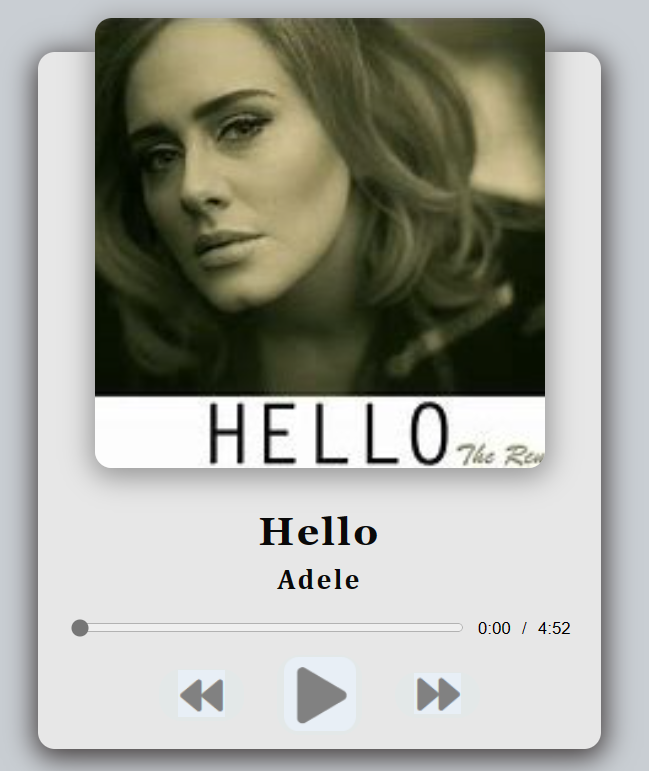

# ReebsMP

ReebsMP is a simple MP3 player web application. It allows users to play, pause, and skip audio tracks, displaying the track name, duration, and progress bar. The application uses HTML, CSS, and JavaScript to provide the basic functionality.

## Preview

## Table of Contents

- [Introduction](#introduction)
- [Preview](#preview)
- [Usage](#usage)
- [Contributing](#contributing)

## Introduction

ReebsMP is a basic MP3 player designed using HTML, CSS, and JavaScript. The application features a minimalistic design and allows users to load MP3 audio files to play. The user interface consists of a play button, a progress bar, track duration, and previous/next track buttons.

## Preview

[Live Demo](https://example.com)

## Usage

1. Clone the repository or download the ZIP file.

2. Open `index.html` in your web browser.

3. To use the MP3 player, follow these steps:
   - Click on the play button to start the audio playback.
   - Use the previous and next buttons to navigate between tracks.
   - The progress bar shows the current progress of the track.
   - The duration is displayed in the format MM:SS.

## Contributing

Contributions are welcome! If you find any bugs or have suggestions for improvements, please open an issue or submit a pull request.

